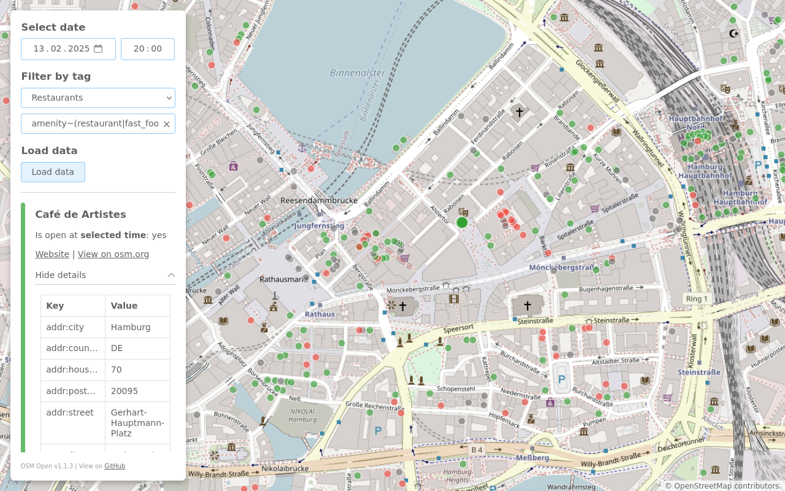

# OSM Open
Shows you open stores and offers a date-filter. This enables you to find open restaurants for e.g. tomorrow evening.

Test this application here: https://hauke-stieler.de/osm-open/

# How to use

1. Zoom to the area you want to search in.
2. Click on "Load data" to load all elements with opening hours.
3. Select date and time. If nothing enteres, the current date and time will be used. 
4. Click on a point to get further information.

# Development
See the [client README](client/README.md) for details.
